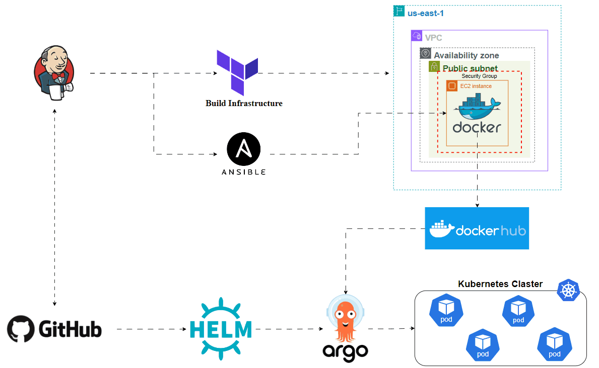

# To-Do App Deployment

This repository contains the infrastructure and deployment setup for the **To-Do App**, a simple task management application. The project is built with a comprehensive DevOps pipeline using Terraform, Ansible, Jenkins, Kubernetes, and ArgoCD for infrastructure and continuous delivery.

## Table of Contents
- [Overview](#overview)
- [Infrastructure](#infrastructure)
  - [Terraform](#terraform)
  - [Ansible](#ansible)
  - [Kubernetes and Helm](#kubernetes-and-helm)
  - [ArgoCD](#argocd)
- [CI/CD Pipeline](#cicd-pipeline)
- [Getting Started](#getting-started)
- [Usage](#usage)
- [Contributing](#contributing)
- [License](#license)

## Overview

This project automates the provisioning of infrastructure and the deployment of the **To-Do App**. The pipeline manages the entire lifecycle from infrastructure creation on AWS (using Terraform) to application deployment on Kubernetes using Helm and ArgoCD.

## Infrastructure

The infrastructure is provisioned and configured using several tools:

### Terraform
The AWS infrastructure is provisioned using Terraform. Resources include:
- VPC, Subnets, and Route Tables
- Security Groups
- EC2 instances for the application
- SSH key management

Terraform files:
- `ec2.tf`: Defines EC2 instance resources.
- `vpc.tf`: Manages the Virtual Private Cloud (VPC) and related networking resources.
- `sg.tf`: Sets up security groups.
- `terraform.tfvars`: Contains variable values (not included in the repo).
- `variable.tf`: Defines variables for the Terraform configuration.

### Ansible
Once the EC2 instance is provisioned, Ansible is used to configure the instance, install necessary dependencies, and deploy the application.

- `ansible-playbook.yml`: An Ansible playbook to automate application deployment and environment setup (e.g., Docker installation, app configuration).

### Kubernetes and Helm
The application is deployed onto a Kubernetes cluster using Helm charts. The setup consists of:
- Helm charts to manage the Kubernetes deployments, services, and other resources.
  
Helm files:
- `k8s/helm/app`: Contains the Helm chart for the To-Do app.
  
### ArgoCD
ArgoCD is used for continuous delivery, managing application deployments on Kubernetes. It monitors changes in the Git repository and updates the application accordingly.

- `k8s/helm/ArgoCD`: Contains the ArgoCD configurations for automated deployments.

## CI/CD Pipeline

### Jenkins
The Jenkins pipeline is designed to automate the entire process from infrastructure provisioning to application deployment. It performs the following steps:
1. Provision infrastructure using Terraform.
2. Run Ansible playbooks to configure instances.
3. Build and push Docker images (if needed).
4. Deploy the application to Kubernetes using Helm and ArgoCD.

The Jenkinsfile is located at the root of the project:
- `Jenkinsfile`: Defines the pipeline stages for infrastructure provisioning and application deployment.

## Getting Started

### Prerequisites
- AWS account for infrastructure provisioning
- Jenkins for the CI/CD pipeline
- Docker for containerization
- Terraform and Ansible installed locally
- Kubernetes cluster (can be managed locally with minikube or on a cloud provider)
